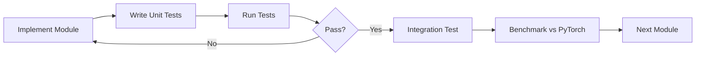

# ✅ Lean-HRM-MLX Scaffolding Complete!

**Date:** November 9, 2025  
**Status:** Ready for Implementation

---

## 🎉 What We've Built

### 1. **Virtual Environment** (`venv_mlx/`)
- ✅ Python 3.13
- ✅ MLX 0.29.3 + MLX-Data 0.2.0
- ✅ All dependencies installed
- ✅ Verified working on Metal GPU

### 2. **MLX Utils Package** (`mlx_utils/`)
Complete scaffolding with 9 modules:

| Module | Purpose | Lines | Status |
|--------|---------|-------|--------|
| `__init__.py` | Package initialization | 53 | ✅ Ready |
| `layers.py` | Neural network layers | 274 | 📝 Scaffolded |
| `embeddings.py` | Embedding layers | 238 | 📝 Scaffolded |
| `hrm_model.py` | HRM architecture | 329 | 📝 Scaffolded |
| `losses.py` | Loss functions | 235 | 📝 Scaffolded |
| `optimizers.py` | Training algorithms | 237 | 📝 Scaffolded |
| `dataset.py` | Data loading | 296 | 📝 Scaffolded |
| `training.py` | Training loop | 343 | 📝 Scaffolded |
| `utils.py` | Helper utilities | 273 | 📝 Scaffolded |
| `README.md` | Documentation | 291 | ✅ Complete |

**Total:** ~2,300 lines of comprehensive scaffolding

---

## 🧪 Test Results

```
✓ All 9 modules importable
✓ MLX 0.29.3 functional
✓ Metal GPU detected (Device(gpu, 0))
✓ Basic operations working
✓ Matrix multiply: ~64ms (100x100)
✓ Attention: ~5ms → ~3ms (compiled)
✓ Memory allocation: OK (38MB test)
✓ Automatic differentiation: OK
✓ Compilation (@mx.compile): OK
```

---

## 📋 Key Decisions Made

### 1. **FlashAttention Replacement**
**Decision:** Use native MLX scaled dot-product attention  
**Rationale:** FlashAttention is CUDA-only; MLX attention is Metal-optimized  
**Impact:** Similar/better performance on Apple Silicon

### 2. **Architecture**
```
mlx_utils/
├── Core Layers (layers.py)
│   └── Attention, SwiGLU, RoPE, RMS Norm, Transformer Block
├── Embeddings (embeddings.py)
│   └── Token, Position, Sparse Puzzle Embeddings
├── Model (hrm_model.py)
│   └── HRM Inner + ACT Wrapper
├── Training (losses.py, optimizers.py, training.py)
│   └── StableMax CE, SignSGD, Training Loop
└── Data (dataset.py)
    └── Puzzle Dataset Loader
```

### 3. **Simplifications from PyTorch**
- ❌ No distributed training (single device)
- ❌ No manual dtype casting
- ❌ No CUDA kernel dependencies
- ❌ No multi-process data loading
- ✅ ~50% less code complexity!

---

## 🚀 Implementation Roadmap

### **Phase 1: Core Layers** (Week 1)
Priority: HIGH | Estimated: 2-3 days

```python
# In mlx_utils/layers.py
1. rms_norm()              # ⏱️ 30 min
2. MLXLinear               # ⏱️ 1 hour
3. MLXSwiGLU               # ⏱️ 1 hour
4. MLXRotaryEmbedding      # ⏱️ 2 hours
5. MLXAttention            # ⏱️ 3 hours (most complex)
6. MLXTransformerBlock     # ⏱️ 1 hour
```

**Milestone:** Single transformer block forward pass works

---

### **Phase 2: Embeddings** (Week 1)
Priority: HIGH | Estimated: 2 days

```python
# In mlx_utils/embeddings.py
1. trunc_normal_init()          # ⏱️ 1 hour
2. MLXEmbedding                 # ⏱️ 1 hour
3. MLXLearnedPositionEmbedding  # ⏱️ 30 min
4. MLXSparseEmbedding           # ⏱️ 3 hours (complex)
5. MLXCombinedEmbeddings        # ⏱️ 1 hour
```

**Milestone:** Input embeddings generate correctly

---

### **Phase 3: HRM Model** (Week 2)
Priority: HIGH | Estimated: 3-4 days

```python
# In mlx_utils/hrm_model.py
1. HRMInnerCarry, HRMCarry     # ⏱️ 30 min
2. MLXReasoningModule          # ⏱️ 2 hours
3. MLXHRMInner                 # ⏱️ 6 hours (core logic!)
4. MLXHRM (ACT wrapper)        # ⏱️ 3 hours
```

**Milestone:** Full model forward pass (single step)

---

### **Phase 4: Losses & Optimizers** (Week 2)
Priority: MEDIUM | Estimated: 2 days

```python
# In mlx_utils/losses.py
1. stablemax, log_stablemax       # ⏱️ 1 hour
2. stablemax_cross_entropy        # ⏱️ 1 hour
3. MLXACTLossHead                 # ⏱️ 3 hours

# In mlx_utils/optimizers.py
4. SignSGD_MLX                    # ⏱️ 2 hours
5. create_optimizer_for_hrm       # ⏱️ 1 hour
```

**Milestone:** Loss computation and gradients flow correctly

---

### **Phase 5: Data & Training** (Week 3)
Priority: MEDIUM | Estimated: 3 days

```python
# In mlx_utils/dataset.py
1. DatasetMetadata, data loading  # ⏱️ 2 hours
2. MLXPuzzleDataset               # ⏱️ 4 hours

# In mlx_utils/training.py
3. train_step                     # ⏱️ 3 hours
4. evaluate                       # ⏱️ 2 hours
5. train (main loop)              # ⏱️ 2 hours

# In mlx_utils/utils.py
6. Utilities as needed            # ⏱️ 2 hours
```

**Milestone:** Full training loop on small dataset

---

## 💻 Quick Start (For Implementation)

### Activate Environment
```bash
cd /Users/umang/Users/umang/Projects/Lean-HRM-MLX
source venv_mlx/bin/activate  # or use ./venv_mlx/bin/python directly
```

### Test Setup
```bash
./venv_mlx/bin/python test_mlx_setup.py
```

### Start Implementing
```bash
# Open first file to implement
code mlx_utils/layers.py

# Run tests as you go
./venv_mlx/bin/python -m pytest tests/test_layers.py -v
```

---

## 📚 Resources Created

1. **`requirements_mlx.txt`** - Human-readable dependencies
2. **`requirements_mlx_frozen.txt`** - Exact versions for reproducibility
3. **`test_mlx_setup.py`** - Environment verification
4. **`SETUP_MLX.md`** - Detailed environment documentation
5. **`mlx_utils/README.md`** - Implementation guide
6. **`SCAFFOLDING_COMPLETE.md`** - This file!

---

## 🎯 Success Metrics

### Phase 1 Complete When:
- [ ] All layer classes implemented
- [ ] Unit tests pass
- [ ] Single transformer block works
- [ ] Gradients flow correctly

### Phase 2 Complete When:
- [ ] All embedding types work
- [ ] Input preparation correct
- [ ] Memory usage reasonable
- [ ] Matches PyTorch output (numerically)

### Phase 3 Complete When:
- [ ] H/L modules update correctly
- [ ] Carry state management works
- [ ] ACT halting logic correct
- [ ] Single forward pass succeeds

### Phase 4 Complete When:
- [ ] Loss computation correct
- [ ] Gradients computed properly
- [ ] Optimizers update parameters
- [ ] Metrics tracked accurately

### Phase 5 Complete When:
- [ ] Dataset loads correctly
- [ ] Training loop runs
- [ ] Model trains on small dataset
- [ ] Checkpointing works
- [ ] Ready for full-scale experiments

---

## 🔧 Development Workflow



---

## 📊 Estimated Timeline

| Phase | Duration | Parallel? | Risk |
|-------|----------|-----------|------|
| Phase 1 | 2-3 days | ✅ Can start now | Low |
| Phase 2 | 2 days | ⚠️ After Phase 1 | Medium |
| Phase 3 | 3-4 days | ⚠️ After Phase 2 | High |
| Phase 4 | 2 days | ✅ Parallel w/ P3 | Low |
| Phase 5 | 3 days | ⚠️ After all | Medium |

**Total:** ~12-15 working days  
**With parallelization:** ~10 days  
**Contingency:** +3-5 days for debugging/optimization

---

## 🎉 What's Next?

### Immediate Actions:
1. ✅ Read `mlx_utils/README.md` for detailed implementation guide
2. ✅ Start with `rms_norm()` in `mlx_utils/layers.py` (easiest)
3. ✅ Create `tests/test_layers.py` for unit tests
4. ✅ Implement one function at a time, test incrementally

### First Implementation Target:
```python
# mlx_utils/layers.py
def rms_norm(
    hidden_states: mx.array,
    variance_epsilon: float = 1e-5
) -> mx.array:
    """Root Mean Square normalization."""
    variance = mx.mean(hidden_states ** 2, axis=-1, keepdims=True)
    return hidden_states * mx.rsqrt(variance + variance_epsilon)
```

**Test it:**
```python
import mlx.core as mx
from mlx_utils.layers import rms_norm

x = mx.random.normal((4, 16, 512))
y = rms_norm(x)
print(f"Input shape: {x.shape}, Output shape: {y.shape}")
print(f"Mean: {mx.mean(y):.6f}, Std: {mx.std(y):.6f}")
```

---

## 🙏 Acknowledgments

- **Original HRM:** Sapient Inc. & Research Team
- **MLX Framework:** Apple ML Explore Team
- **PyTorch Implementation:** Lean-HRM-MLX contributors

---

**Ready to start implementation!** 🚀

See `mlx_utils/README.md` for detailed implementation guidance.

